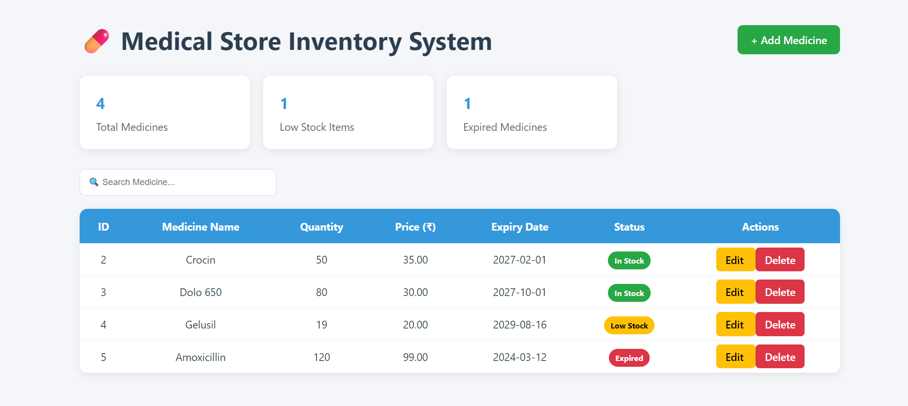
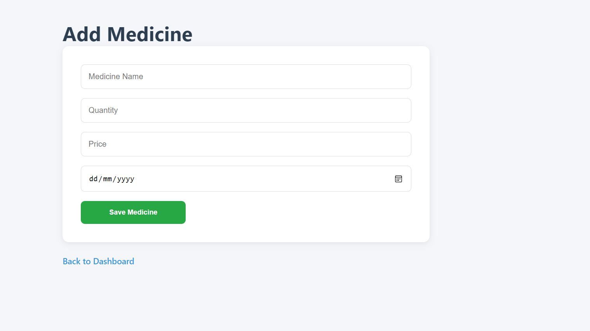
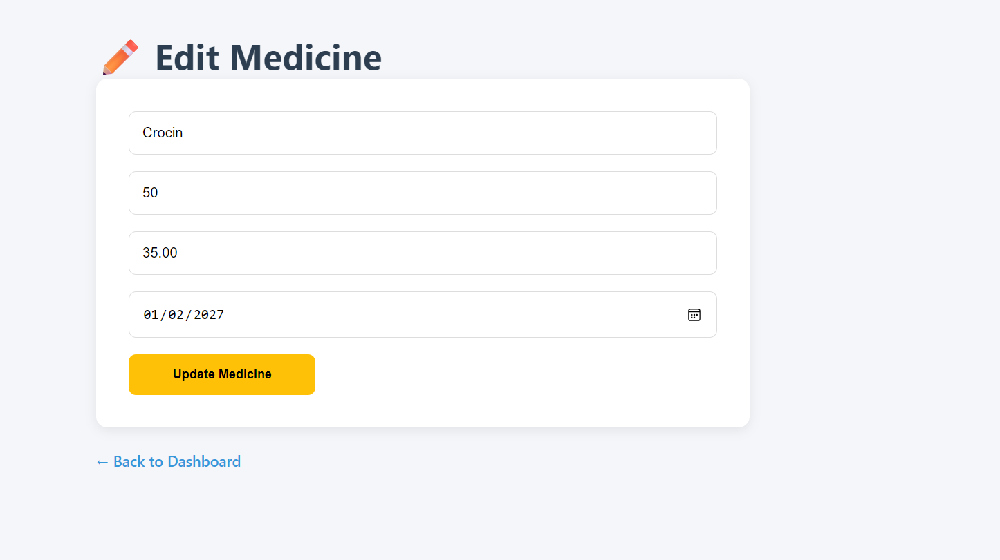

# Medical Store Inventory System

A Flask and MySQL based web application for managing medicines in a medical store.

## Features

- Add Medicines
- Edit Medicines
- Delete Medicines
- Search Medicines
- Low Stock Indicator
- Expiry Date Indicator
- Inventory Dashboard
- MySQL Database Integration

## Technologies Used

- Python
- Flask
- MySQL
- HTML
- CSS
- Jinja2

## Project Structure

MedicalStoreInventorySystem/

├── app.py

├── requirements.txt

├── README.md

├── static/

│   └── style.css

└── templates/

    ├── index.html

    ├── add.html

    └── edit.html

## Installation

Clone the repository

```bash
git clone https://github.com/kevaljasaniconnect-tech/MedicalStoreInventorySystem.git
```

Move into project directory

```bash
cd MedicalStoreInventorySystem
```

Install dependencies

```bash
pip install -r requirements.txt
```

Run the application

```bash
python app.py
```

Open

```text
http://127.0.0.1:5000
```

## Database Setup

Create Database

```sql
CREATE DATABASE medicalstore;
```

Create Medicines Table

```sql
CREATE TABLE Medicines(
    MedicineID INT PRIMARY KEY AUTO_INCREMENT,
    MedicineName VARCHAR(100),
    Quantity INT,
    Price DECIMAL(10,2),
    ExpiryDate DATE
);
```
## Screenshots

### Dashboard



### Add Medicine



### Edit Medicine


## Future Improvements

- User Authentication
- Export Inventory Reports
- Sales Management
- Supplier Management
- Responsive Mobile UI

## Author

Keval Jasani